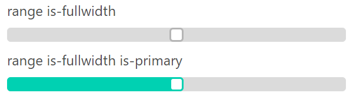

# bulma-range
Bulma's extension to input type=range



## Demo

- [Demo](https://uk-taniyama.github.io/bulma-range/test/)

## How to use

- css `dist/css/bulma-range.min.css`
- sass `bulma-range.sass`

```
@import "bulma/bulma.sass";
@import "bulma-range/bulma-range.sass";
```
